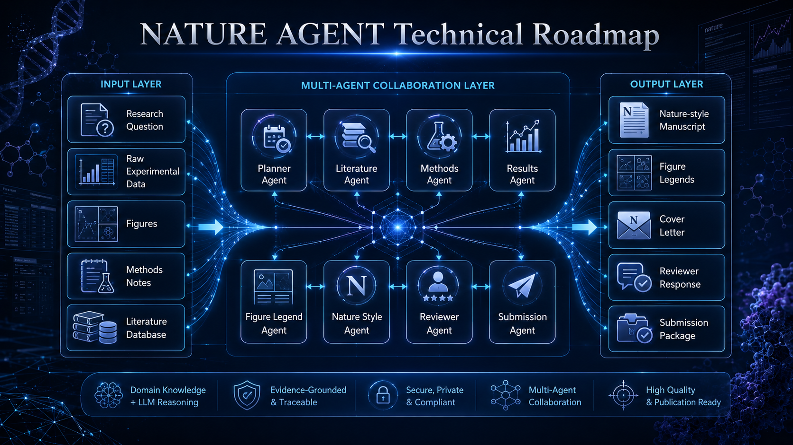

# Nature Agent



Nature Agent is a multi-agent workflow pack for scientific research writing. It provides a reusable research team for paper reading, evidence mapping, citation management, manuscript drafting, language polishing, figure planning, data availability checks, reviewer responses, and paper-to-PPT workflows.

## Team Roles

| Agent | Purpose |
|---|---|
| `nature-team-lead` | Workflow coordinator and final compiler |
| `paper-reader` | Paper deep reading and figure grounding |
| `literature-searcher` | Literature search planning and evidence maps |
| `citation-manager` | Claim-level citation matching and formatting |
| `manuscript-writer` | Manuscript section drafting and restructuring |
| `language-polisher` | Nature-style scientific English polishing |
| `figure-designer` | Scientific figure planning and plotting guidance |
| `data-availability-checker` | Data Availability and FAIR checks |
| `reviewer-response-writer` | Reviewer comment maps and response letters |
| `ppt-builder` | Paper-to-PPT and journal club slide planning |
| `quality-editor` | Scientific quality gate and editorial decision |

## Workflows

### Workflow A: Paper Reading

```text
paper-reader -> optional literature-searcher -> quality-editor -> final report
```

### Workflow B: Manuscript Writing

```text
literature-searcher + citation-manager + data-availability-checker -> manuscript-writer -> language-polisher -> quality-editor -> final text
```

### Workflow C: Scientific Figure

```text
figure-designer -> quality-editor -> figure-designer -> final figure plan/code
```

### Workflow D: Reviewer Response

```text
reviewer-response-writer -> citation-manager + manuscript-writer -> quality-editor -> final response letter
```

### Workflow E: Paper to PPT

```text
paper-reader -> quality-editor -> ppt-builder -> final PPT or slide outline
```

## License

MIT. See [LICENSE](LICENSE).

Author: Linxiong Ye
Email: 445233812@qq.com

If you would like access to the complete Nature Agent version, please feel free to contact the author by email. I would also sincerely welcome exchanges and shared learning on the development and practice of scientific AI agents.
